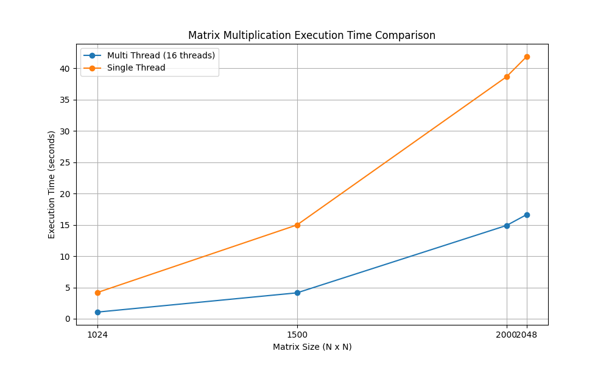

# 한기대 2024 운영체제 과제

2019136135 최준호 운영체제 과제

## 요구사항
Linux혹은 Linux와 유사한 운영체제 환경에서

1. 쓰레드 16개(4x4블록)를 사용해서 A, B, C 세 개의 행렬이 모두 NxN 행렬이라고 가정하고 1024x1024, 1500x1500, 2000x2000, 2048x2048의 행렬 곱셉을 수행하는 프로그램을 작성하시오.

[1번 해결]()

2. 붙임 2의 알고리즘을 약간 변형하여 쓰레드의 수를 16개로 고정하고 쓰레드당 여러 개의 행을 처리하도록 프로그램을 수정할 수 있다. 예로 1024x1024행렬의 경우 하나의 쓰레드 당 64개의 행을 처리하면 된다. 이 프로그램을 이용하여 1024x1024, 1500x1500, 2000x2000, 2048x2048의 행렬 곱셉을 수행하는 프로그램을 작성하시오.

[2번 해결]()

위 두 프로그램을 수행하여 각 행렬 크기별로 수행된 행렬 곱셈의 수행 시간을 측정해서 그래프로 표시하시오.
각 방법에 대한 비교를 위해 단일 쓰레드로 수행한 단순 행렵곱셈에 대한 시간도 그래프에 표시하시오. 

행렬 곱셉은 일반적으로 _O(N3)_의 수행 복잡도를 가지고 있다.
이상적인 경우 N이 커짐에 따라 수행 복잡도에 따라 시간 변화를 예측할 수 있다. 
하지만 실제 수행 시간은 이 복잡도와 일치하지 않을 것이다. 
이 차이가 발생하는 원인에 대한 본인의 생각을 제시하시오.

---

그리고, 1이나 2의 코드를 수행시간이 개선될 수 있도록 변경하고, 수행시간을 측정하시오.
